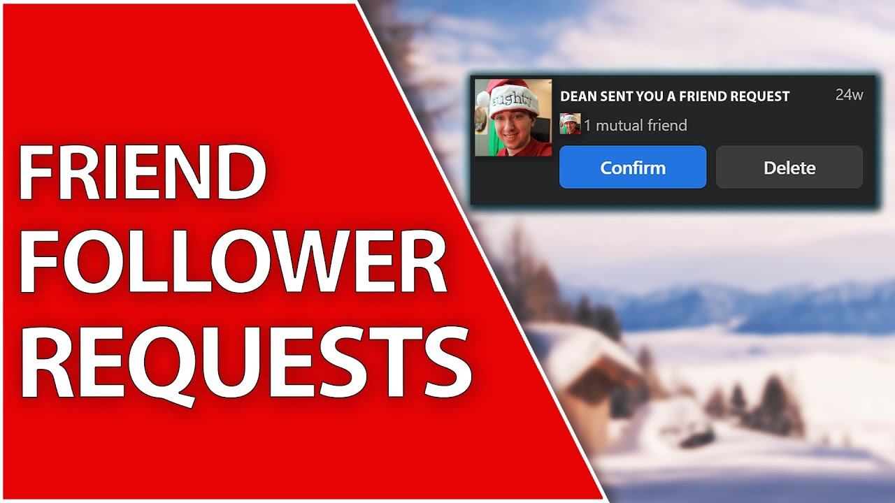

[](https://badge.fury.io/rb/followability)


[](https://github.com/rubocop/rubocop)


# Followability
Implements the social network followable functionality for your Active Record models

## Installation
```ruby
gem 'followability', github: 'nejdetkadir/followability', branch: 'main'
```

Install the gem and add to the application's Gemfile by executing:
```bash
$ bundle add followability
```

If bundler is not being used to manage dependencies, install the gem by executing:
```bash
$ gem install followability
```

Run the generator for creating database migration and copying localization files.
```bash
$ rails g followability:install
```

## Usage
Simply drop in `followability` to a model:

```ruby
class User < ActiveRecord::Base
  followability
end
```

Now, instances of `User` have followability.
```ruby
User.followability?
# => true
```

### Following actions
Avaiable methods:
- decline_follow_request_of
- remove_follow_request_for
- send_follow_request_to
- unfollow
- following?
- mutual_following_with?
- sent_follow_request_to?

### Usage
```ruby
@foo = User.first
@bar = User.last

@foo.send_follow_request_to(@bar)
# => true

@foo.sent_follow_request_to?(@bar)
# => true

@bar.decline_follow_request_of(@foo)
# => true

@bar.accept_follow_request_of(@foo)
# => false

@bar.errors.full_messages
# => [...]

@bar.unfollow(@foo)
# => false

@bar.errors.full_messages
# => [...]

@foo.remove_follow_request_for(@bar)
# => false

@foo.errors.full_messages
# => [...]

@foo.mutual_following_with?(@bar)
# => false

@bar.following?(@foo)
# => false
```

### Blocking actions
Avaiable methods:
- block
- unblock
- blocked?
- blocked_by?

### Usage
```ruby
@foo.block(@bar)
# => true

@foo.blocked?(@bar)
# => true

@bar.blocked_by?(@foo)
# => true

@foo.unblock(@bar)
# => true
```

### Common
Avaiable methods:
- myself?

### Usage
```ruby
class User < ActiveRecord::Base
  followability
  
  def follow_request_removed_by_someone(record)
    unless myself?(record)
      # Do something
    end
  end
end
```

### Relations
Avaiable methods:
- follow_requests
- pending_requests
- followerable_relationships
- followable_relationships
- followers
- following
- blocks
- blockers

### Usage
```ruby
@foo.follow_requests
# => [#<Followability::Relationship ...>]

@foo.pending_requests
# => [#<Followability::Relationship ...>]

@foo.followerable_relationships
# => [#<Followability::Relationship ...>]

@foo.followable_relationships
# => [#<Followability::Relationship ...>]

@foo.followers
# => [#<User ...>]

@foo.following
# => [#<User ...>]

@foo.blocks
# => [#<User ...>]

@foo.blockers
# => [#<User ...>]
```

### Callback Methods
Available methods:
- follow_request_sent_to_me
- follow_request_sent_to_someone
- follow_request_accepted_by_me
- follow_request_accepted_by_someone
- follow_request_declined_by_me
- follow_request_declined_by_someone
- follow_request_removed_by_me
- follow_request_removed_by_someone
- followable_blocked_by_me
- followable_blocked_by_someone
- followable_unblocked_by_me
- followable_unblocked_by_someone
- unfollowed_by_me
- unfollowed_by_someone
- followability_triggered

### Usage
```ruby
class User < ActiveRecord::Base
  followability

  def follow_request_sent_to_me(record)
    Notifications::FollowRequestSentToMeJob.perform_later(from_id: record.id)
  end

  def follow_request_sent_to_someone(record); end
  def follow_request_accepted_by_me(record); end
  def follow_request_accepted_by_someone(record); end
  def follow_request_declined_by_me(record); end
  def follow_request_declined_by_someone(record); end
  def follow_request_removed_by_me(record); end
  def follow_request_removed_by_someone(record); end
  def followable_blocked_by_me(record); end
  def followable_blocked_by_someone(record); end
  def followable_unblocked_by_me(record); end
  def followable_unblocked_by_someone(record); end
  def unfollowed_by_me(record); end

  def unfollowed_by_someone(record)
    Followability::RemoveFollowedUserJob.perform_later(user_id: record.id)
  end

  def followability_triggered(record, callback_name); end
end
```

## I18n
```yml
---
en:
  followability:
    errors:
      block:
        unblock:
          myself: 'You can not run this action for yourself'
        block:
          myself: 'You can not run this action for yourself'
          blocked_by: 'You can not block to who blocked to you'
          already_blocked: '%{klass} already blocked'
          not_blocked_for_blocking: 'You can not unblock to %{klass} because was not blocked'
      follow:
        unfollow:
          myself: 'You can not run this action for yourself'
          empty_relation: 'You can not unfollow to %{klass} because was not followed'
        decline_follow_request_of:
          myself: 'You can not run this action for yourself'
          empty_relation: 'You can not decline follow request of %{klass} because was not sent'
        accept_follow_request_of:
          myself: 'You can not run this action for yourself'
          empty_relation: 'You can not accept follow request of %{klass} because was not sent'
        remove_follow_request_for:
          empty_relation: 'You can not remove follow request of %{klass} because was not sent'
          myself: 'You can not run this action for yourself'
        send_follow_request_to:
          myself: 'You can not run this action for yourself'
          blocked_by: 'You can not send follow request to who blocked to you'
          following: 'You are already following to %{klass}'
          already_sent: 'You are already sent follow request'
          blocked: 'You can not send follow request to blocked %{klass}'
```

## Mentioned Youtube Video


You can watch [@Deanout](https://github.com/Deanout)'s [Friend Request And Followers - Followability Gem | Ruby On Rails 7 Tutorial Video](https://www.youtube.com/watch?v=UVa1QPaITQM) on Youtube.

## Development

After checking out the repo, run `bin/setup` to install dependencies. Then, run `rake test` to run the tests. You can also run `bin/console` for an interactive prompt that will allow you to experiment.

To install this gem onto your local machine, run `bundle exec rake install`. To release a new version, update the version number in `version.rb`, and then run `bundle exec rake release`, which will create a git tag for the version, push git commits and the created tag, and push the `.gem` file to [rubygems.org](https://rubygems.org).

## Contributing

Bug reports and pull requests are welcome on GitHub at https://github.com/nejdetkadir/followability. This project is intended to be a safe, welcoming space for collaboration, and contributors are expected to adhere to the [code of conduct](https://github.com/nejdetkadir/followability/blob/main/CODE_OF_CONDUCT.md).

## License

The gem is available as open source under the terms of the [MIT License](LICENSE).

## Code of Conduct

Everyone interacting in the Followability project's codebases, issue trackers, chat rooms and mailing lists is expected to follow the [code of conduct](https://github.com/nejdetkadir/followability/blob/main/CODE_OF_CONDUCT.md).
